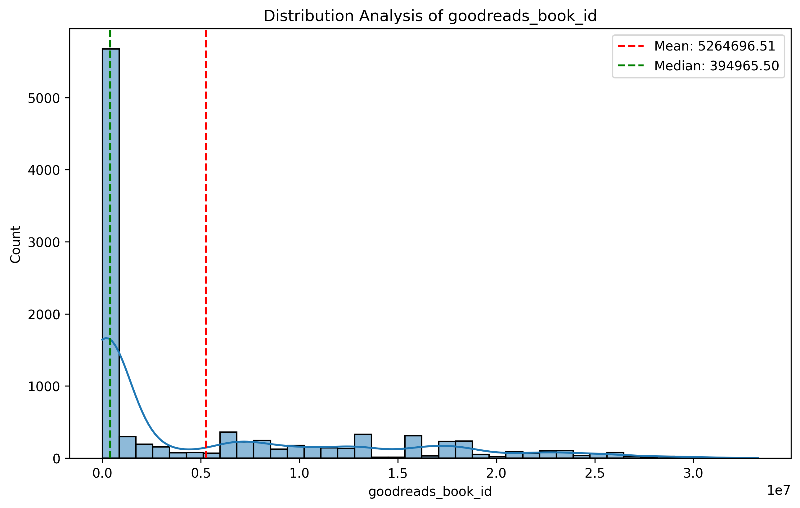
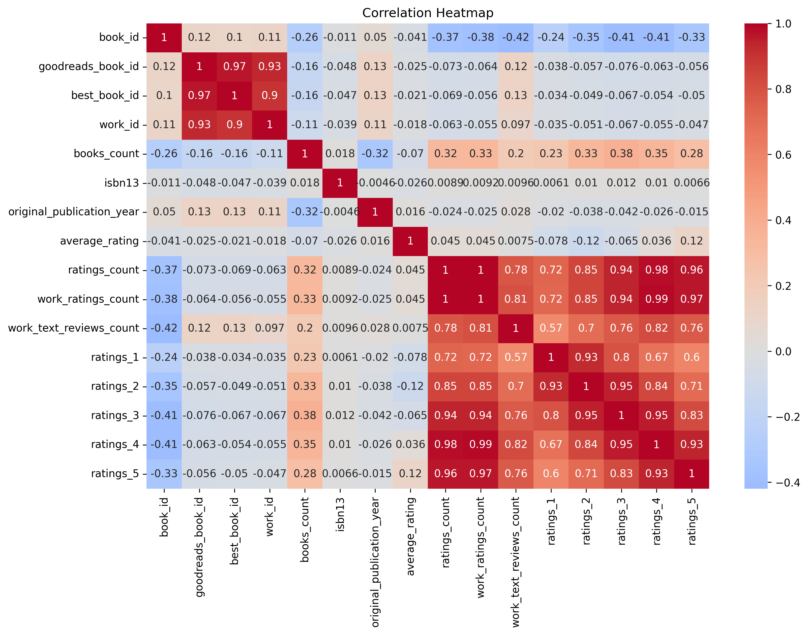

# Goodreads Dataset Analysis Report

## Executive Summary

This report provides a comprehensive analysis of the Goodreads dataset, which contains 10,000 records about various books, including their ratings, reviews, and publication information. The analysis aims to uncover distribution patterns, correlations between various metrics, and significant trends that can inform strategic decisions. The findings reveal strong correlations between ratings metrics and highlight the presence of outliers that warrant further investigation. Additionally, several trends indicating declining ratings and reviews over time are observed.

---

## Detailed Analysis of Distributions and Correlations

### Distribution Analysis

1. **Book ID Distribution**
   - The distribution of `book_id` shows a symmetric pattern with a mean and median of **5000.5**. The standard deviation is **2886.90**, indicating a relatively wide spread of book IDs.
   

2. **Goodreads Book ID Distribution**
   - The `goodreads_book_id` distribution is positively skewed (skew = 1.35), with a mean of **5264696.51** and a median of **394965.5**. This suggests that while most books have lower IDs, a few books have exceptionally high IDs, indicating potential outliers or unique entries.
   

### Correlation Analysis

A correlation heatmap reveals several strong correlations among various metrics:

- `goodreads_book_id` and `work_id` (0.93)
- `best_book_id` and `goodreads_book_id` (0.97)
- `ratings_count` and `work_ratings_count` (0.99)
  
These correlations suggest that certain identifiers (e.g. `goodreads_book_id`, `best_book_id`, and `work_id`) are closely related and can likely be used interchangeably in certain analyses. In addition, the high correlation between ratings metrics indicates that as one increases, the others tend to do so as well.

---

## Key Findings and Patterns

1. **Outliers**: 
   - An outlier was identified with the following attributes:
     - **book_id**: 0
     - **average_rating**: 158
     - **ratings_count**: 1163
   This book exhibits unusually high average ratings, raising questions about its legitimacy or data entry accuracy.

2. **Trends**:
   - A declining trend is observed in several metrics:
     - Ratings (`ratings_1` to `ratings_5`) are decreasing, which may indicate a waning interest in books over time or potentially a shift in user engagement.
     - **Ratings Count**: The trend slope of **-20.34** suggests a significant decline in the number of ratings over time.
     - **Work Ratings Count**: A similar trend with a slope of **-22.24** further emphasizes the downward trajectory of user engagement.

---

## Strategic Recommendations

1. **Investigate Outliers**:
   - Conduct a deeper analysis of the identified outlier to understand its context within the dataset. This might involve checking for data entry errors or unique characteristics that should be accounted for.

2. **Engagement Strategies**:
   - Given the declining trends in ratings and reviews, it's crucial to implement strategies to boost user engagement. This could include promotional campaigns, author interactions, or special events to encourage users to leave more ratings and reviews.

3. **Focus on Correlation Insights**:
   - Utilize the strong correlations identified to refine marketing strategies. For example, targeting books with high `work_ratings_count` and `ratings_count` may yield better engagement due to their established popularity.

4. **Monitor Trends Regularly**:
   - Implement regular monitoring of the trends observed in ratings and reviews. This data can provide insights into changing reader preferences and inform future acquisitions or marketing focus.

5. **Enhance Data Quality**:
   - Regular audits and data cleaning processes could help in maintaining the quality of the dataset, ensuring that outliers and anomalies are addressed promptly.

By leveraging these findings and recommendations, stakeholders can make informed decisions to enhance engagement and ensure the sustainability of their offerings in the competitive book market.