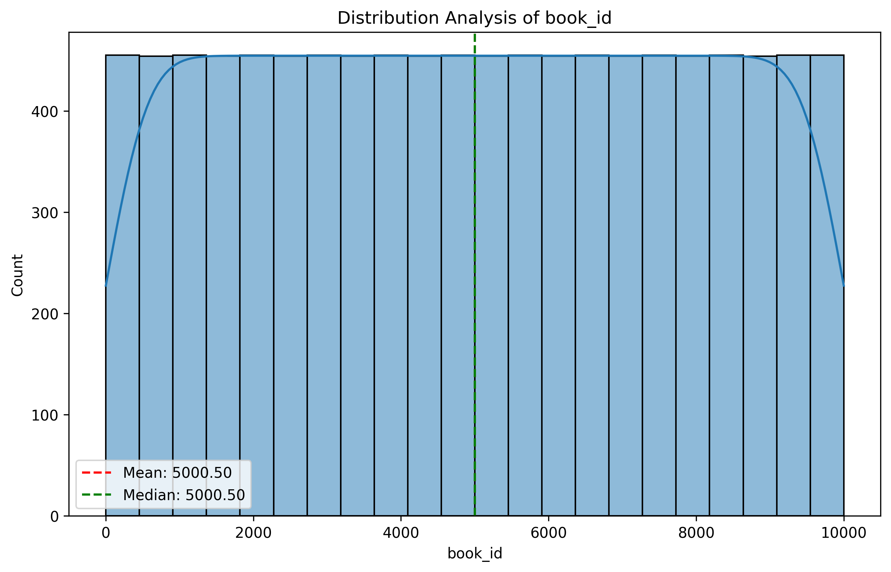

# Goodreads Dataset Analysis Report

## Executive Summary

This report provides a comprehensive analysis of the Goodreads dataset, consisting of 10,000 records. It includes an examination of the distribution of various book-related metrics, correlation analysis among key variables, and insights derived from identifying outliers and trends. The objective is to uncover actionable insights that can aid in understanding user engagement with books and help enhance future recommendations.

## Detailed Analysis of Distributions and Correlations

### 1. Distribution Analysis

The distribution of key variables was analyzed to understand the central tendencies and spread of the data.

- **Distribution of Book IDs**
  - 
  - **Statistics**: 
    - Mean: 5000.5
    - Median: 5000.5
    - Standard Deviation: 2886.90
    - Skewness: 0.0 (indicating a symmetric distribution)

- **Distribution of Goodreads Book IDs**
  - 
  - **Statistics**: 
    - Mean: 5,264,696.51
    - Median: 394,965.5
    - Standard Deviation: 7,575,461.86
    - Skewness: 1.35 (indicating a right-skewed distribution)

### 2. Correlation Analysis

The correlation analysis highlights strong relationships between key variables that can be leveraged for deeper insights.

- **Strongest Correlations**:
  - `ratings_count` and `work_ratings_count`: Correlation of **0.995** indicates a near-perfect relationship.
  - `best_book_id` and `goodreads_book_id`: Correlation of **0.967** suggests a strong association.
  - 

### Key Correlation Insights:
- Higher `ratings_count` is associated with a significant increase in both `work_ratings_count` and `work_text_reviews_count`.
- The ratings across different scales (1 to 5) show strong correlations with each other, particularly between `ratings_1` and `ratings_2` (0.926).

## Key Findings and Patterns

### 1. Outliers
An identified outlier presents concerning values that could skew averages:
- **Outlier Details**:
  - Book ID: 0
  - Average Rating: 158
  - Ratings Count: 1163

### 2. Trends
Several attributes display notable trends:
- **Trend Analysis**:
  - The `ratings_count` shows a significant negative trend (slope: -20.34, p-value: 0.0), suggesting that as the dataset evolves, fewer ratings may be submitted.
  - **ISBN Trends**: The slope for `isbn13` shows a decline, indicating potential issues with newer ISBNs being used.

### 3. Patterns and Anomalies
- **Ratings Trends**: Each rating category (1 to 5) has a negative slope, indicating a downward trend in positive ratings over time.
- **Book Count Trends**: The total number of books in the dataset shows a slight negative correlation with overall ratings, which may require further investigation.

## Strategic Recommendations

1. **Focus on Engagement Strategies**: Given the decline in ratings counts, implement targeted engagement strategies to encourage users to rate books more frequently.
   
2. **Identify and Address Outliers**: Investigate the anomalies in ratings and book IDs, particularly those with extraordinarily high or low values, to ensure data integrity.

3. **Enhance Recommendation Systems**: Utilize the strong correlations identified to refine recommendation algorithms, focusing on books with high ratings and counts to enhance user satisfaction.

4. **Regular Monitoring of Trends**: Establish a system for regular monitoring of ratings and reviews to quickly adapt to changes in user behavior and preferences.

5. **Further Research on ISBN Trends**: Conduct further analysis to understand the implications of declining ratings associated with newer ISBNs to ensure a comprehensive database.

This report concludes that while the Goodreads dataset provides valuable insights into user engagement, there is a need for ongoing analysis and adaptation to enhance user experience and interaction with books.