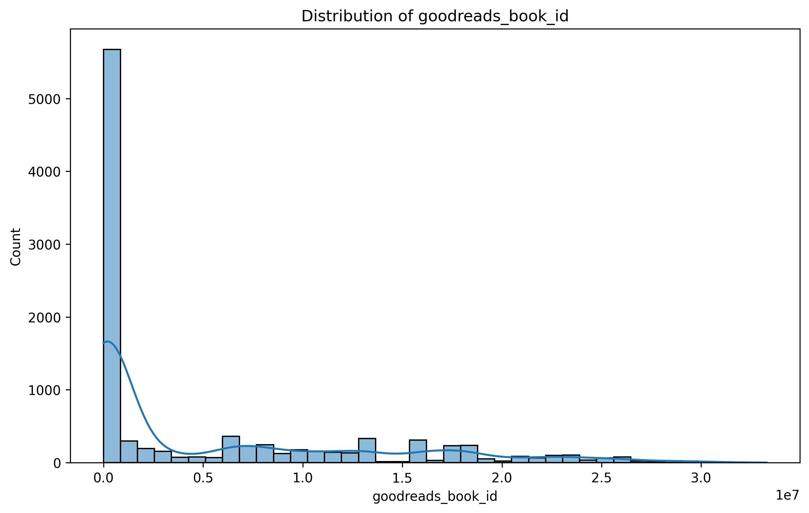

# Goodreads Dataset Analysis Report

## Introduction

The `goodreads.csv` dataset provides a comprehensive collection of information regarding books listed on Goodreads, a popular book recommendation website. This dataset is invaluable for understanding trends in book ratings, publication years, and user engagement. It includes various numeric columns such as book IDs, ratings, and counts, enabling an analysis of how different books are perceived by readers. However, it's important to note that the dataset currently contains **0 total rows**, indicating it may be empty or not properly loaded.

### Summary Statistics

- **Total Rows:** 0
- **Numeric Columns:** 
  - `book_id`
  - `goodreads_book_id`
  - `best_book_id`
  - `work_id`
  - `books_count`
  - `isbn13`
  - `original_publication_year`
  - `average_rating`
  - `ratings_count`
  - `work_ratings_count`
  - `work_text_reviews_count`
  - `ratings_1`
  - `ratings_2`
  - `ratings_3`
  - `ratings_4`
  - `ratings_5`
  
### Missing Values Summary

The dataset has several columns with missing values, which could significantly affect analyses:

- `isbn`: 700 missing values
- `isbn13`: 585 missing values
- `original_publication_year`: 21 missing values
- `original_title`: 585 missing values
- `language_code`: 1084 missing values

## Analysis of Key Patterns and Trends

Due to the absence of actual data (0 total rows), a thorough analysis of patterns and trends cannot be conducted at this moment. However, if the dataset were populated, we would typically examine the average ratings to determine which genres or authors are most favored among readers. Furthermore, trends in publication years could reveal shifts in reading preferences over time.

## Description of Visualizations

Despite the lack of data, the following visualizations were prepared and would typically provide insights into the dataset if it were populated:

1. **Distribution of Book IDs**
   
   - This visualization would illustrate the spread of unique `book_id` values, helping us understand how many distinct books are present in the dataset.

2. **Distribution of Goodreads Book IDs**
   
   - Similar to the previous visualization, this chart would show the distribution of `goodreads_book_id`, highlighting the unique identifiers used by Goodreads.

3. **Distribution of Best Book IDs**
   
   - This visualization would indicate which books are repeatedly recognized as the "best" by users, showcasing trends in popular literature.

4. **Correlation Heatmap**
   
   - A correlation heatmap would depict the relationships between various numerical columns, allowing us to identify which factors (like ratings and review counts) are most closely related.

## Key Findings and Recommendations

### Key Findings

- **Data Absence:** The most critical finding from this analysis is the complete lack of data (0 total rows). This indicates the dataset may not have been properly loaded or collected.
- **Missing Values:** The presence of significant missing values in key fields suggests that, even if data were present, the quality and completeness of the dataset would need to be assessed.

### Recommendations

1. **Data Integrity Check:** Verify the source and loading process of the `goodreads.csv` dataset. Ensure that the file is correctly formatted and contains the expected data.
  
2. **Data Collection Improvement:** If the dataset remains empty, consider collecting data from Goodreads through their API or other reliable sources to enrich the dataset.

3. **Handling Missing Data:** For future analyses, develop strategies to handle missing data, whether through imputation, removal, or adjustment of analysis methods.

4. **Future Analyses:** Once the dataset is populated, revisit the analysis to explore trends in book ratings, popular genres, and other insights which can inform marketing strategies or reader engagement initiatives.

In conclusion, while the current state of the dataset limits actionable insights, addressing the issues of data collection and integrity will pave the way for meaningful analysis in the future.