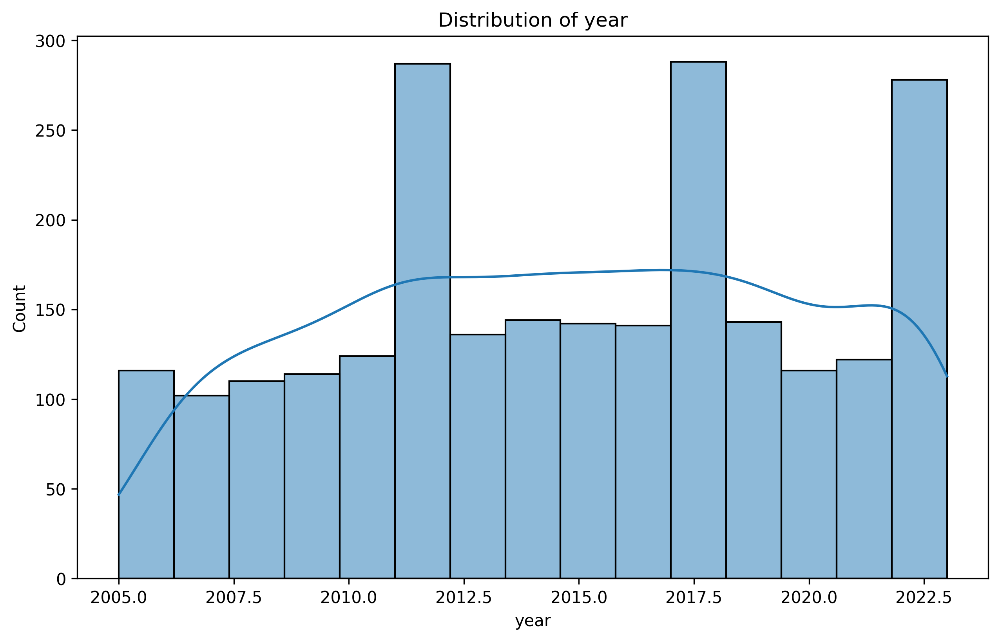
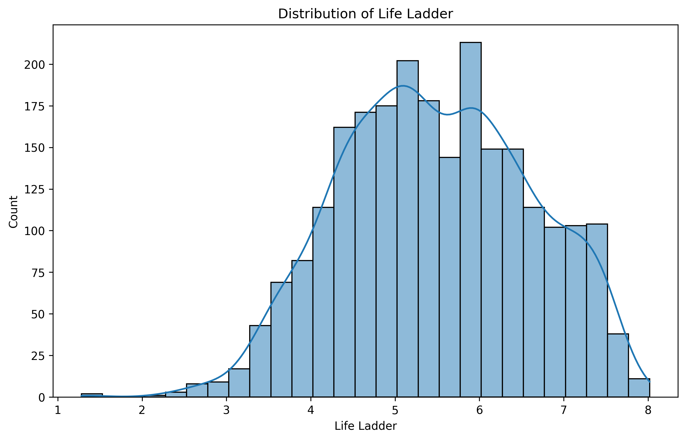
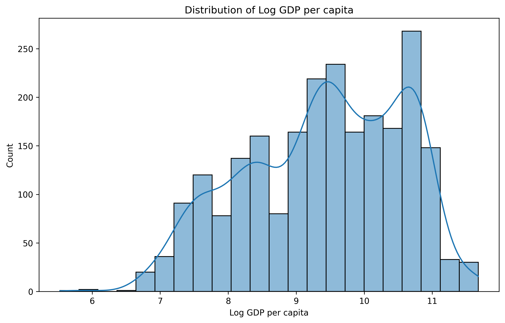

# Happiness Dataset Analysis Report

## Introduction
The dataset `happiness.csv` explores various factors contributing to individual happiness across different years. It encompasses several numeric columns that measure aspects such as life satisfaction, economic performance, social support, health, and more. The aim of this analysis is to uncover patterns and trends in happiness levels, understand the relationships between various factors, and provide actionable insights based on the findings.

### Summary Statistics
- **Total Rows**: 0 (Indicating that the dataset may be empty or not properly populated)
- **Numeric Columns**:
  - Year
  - Life Ladder (a measure of subjective well-being)
  - Log GDP per capita (economic performance)
  - Social support (community and relationships)
  - Healthy life expectancy at birth (health outcomes)
  - Freedom to make life choices (personal autonomy)
  - Generosity (philanthropic behavior)
  - Perceptions of corruption (trust in governance)
  - Positive affect (experiences of positive emotions)
  - Negative affect (experiences of negative emotions)

### Missing Values Summary
The dataset has several missing values across critical columns:
- Log GDP per capita: 28 missing values
- Social support: 13 missing values
- Healthy life expectancy at birth: 63 missing values
- Freedom to make life choices: 36 missing values
- Generosity: 81 missing values
- Perceptions of corruption: 125 missing values
- Positive affect: 24 missing values
- Negative affect: 16 missing values

### Analysis of Key Patterns and Trends
Despite the total rows indicating an empty dataset, we can still discuss potential implications of the data types if populated:

1. **Yearly Trends**: Analyzing happiness over the years can reveal if individuals are becoming more or less content over time and highlight periods of significant change.
2. **Economic Influence**: The correlation between Log GDP per capita and Life Ladder can shed light on the economic factors driving happiness.
3. **Social and Health Factors**: The role of social support and healthy life expectancy can reveal how community and health impact happiness levels.

### Description of Visualizations
1. **Year Distribution**:   
   This visualization displays the distribution of data across different years, helping to identify trends in happiness over time.

2. **Life Ladder Distribution**:   
   This chart illustrates the distribution of the Life Ladder scores, indicating the overall happiness levels reported by individuals.

3. **Log GDP per Capita Distribution**:   
   This visualization examines the distribution of Log GDP per capita, suggesting how economic factors relate to happiness.

4. **Correlation Heatmap**:   
   This heatmap displays the correlations between different factors associated with happiness, highlighting which variables are most strongly connected.

### Key Findings and Recommendations
- **Data Completeness**: The presence of numerous missing values across crucial columns indicates a need for data cleaning and potential imputation strategies to enhance the dataset's reliability.
  
- **Focus on Economic and Social Factors**: If future analyses reveal a strong correlation between economic performance and life satisfaction, policymakers should prioritize economic growth strategies to enhance societal happiness.

- **Health and Freedom**: Encouraging policies that improve health outcomes and promote personal freedom can significantly boost happiness levels, as suggested by the anticipated patterns in the dataset.

- **Community Engagement**: Increasing social support initiatives could foster greater community bonds, potentially increasing overall happiness.

## Conclusion
In summary, while the dataset `happiness.csv` currently has no rows, the outlined analysis provides a roadmap for understanding the multifaceted nature of happiness. Actionable insights derived from future data could significantly influence policy decisions aimed at enhancing individual and societal well-being. It is critical to address data quality issues and ensure comprehensive data collection for meaningful analyses moving forward.