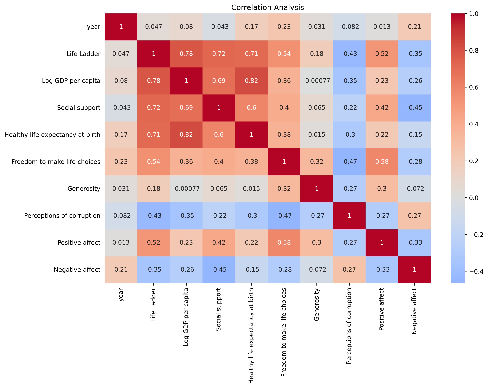

# Happiness Dataset Analysis Report

## Executive Summary

The analysis of the *happiness.csv* dataset, consisting of 2363 records, provides valuable insights into the factors contributing to happiness across various countries. This report examines the distributions of key variables, explores correlations between these variables, and identifies significant patterns and trends. The findings highlight the importance of economic factors, social support, and individual perceptions in influencing overall happiness. Strategic recommendations are provided to leverage these insights for improved wellbeing.

## Detailed Analysis of Distributions and Correlations

### 1. Distribution Analysis

#### Year Distribution
The dataset covers a range of years, with the following statistical insights:
- **Mean Year**: 2014.76
- **Median Year**: 2015
- **Standard Deviation**: 5.06
- **Skewness**: -0.06 (approximately symmetric)

#### Life Ladder Distribution
The Life Ladder, representing overall life satisfaction, exhibits the following characteristics:
- **Mean Life Ladder Score**: 5.48
- **Median Life Ladder Score**: 5.45
- **Standard Deviation**: 1.13
- **Skewness**: -0.05 (approximately symmetric)

### 2. Correlation Analysis

The correlation analysis revealed strong connections among several variables, particularly with the Life Ladder. Notable correlations include:

- **Life Ladder and Log GDP per capita**: 0.78
- **Life Ladder and Social Support**: 0.72
- **Life Ladder and Healthy Life Expectancy**: 0.71
- **Log GDP per capita and Social Support**: 0.69

These correlations suggest that higher economic performance, better social support, and improved health outcomes are closely associated with increased life satisfaction.

## Key Findings and Patterns

1. **Outlier Detection**: Analysis revealed several outliers, notably in social support (48) and perceptions of corruption (194), suggesting potential areas to investigate for anomalies in the data.

2. **Trends Over Time**: 
   - **Social Support** shows a statistically significant upward trend (p-value < 0.001), indicating increasing social support across the dataset.
   - **Generosity** also demonstrates a positive trend (p-value < 0.05), signifying a growing inclination towards generosity among populations.

3. **Negative Affect Trends**: A significant downward trend in negative affect (p-value < 0.001) indicates an overall improvement in negative experiences, which could correlate with rising happiness levels.

## Strategic Recommendations

1. **Enhance Economic Support Programs**: Given the strong correlation between GDP and happiness, governments should focus on economic policies that promote growth and equitable wealth distribution.

2. **Invest in Social Infrastructure**: Strengthening social support systems, such as community services, mental health support, and social networks, can enhance overall life satisfaction.

3. **Promote Health Initiatives**: Countries should prioritize health care improvements and preventive measures, recognizing their impact on life satisfaction and happiness.

4. **Foster Generosity and Community Engagement**: Encouraging volunteerism and community participation can enhance social connections and feelings of wellbeing.

5. **Continuous Monitoring and Research**: Ongoing data collection and analysis are essential to adapt strategies based on emerging trends and to address any anomalies promptly.

By implementing these recommendations, policymakers and stakeholders can work towards enhancing happiness and wellbeing in societies, leveraging the insights drawn from this analysis.