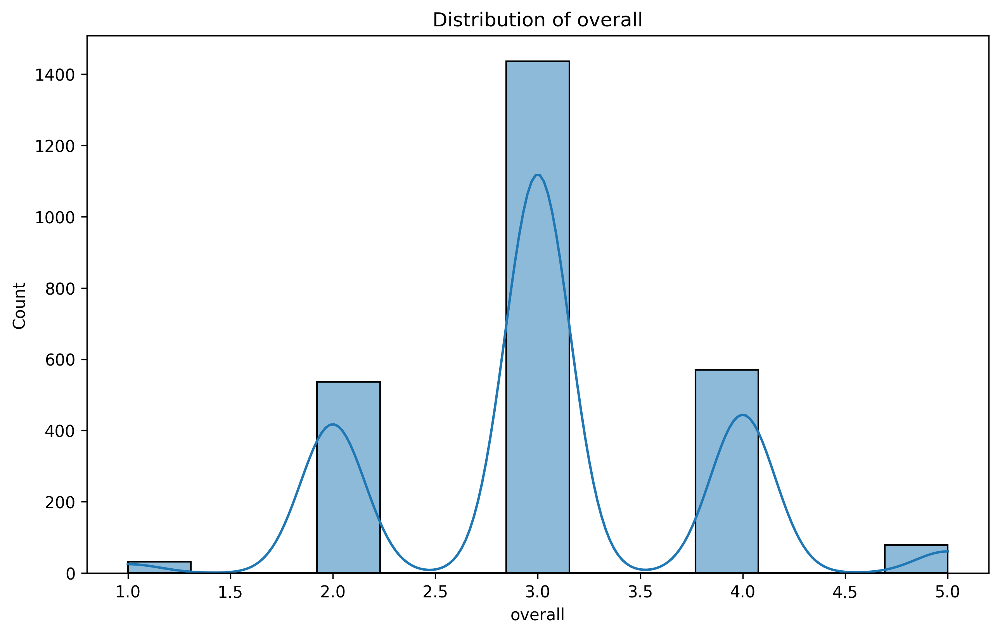
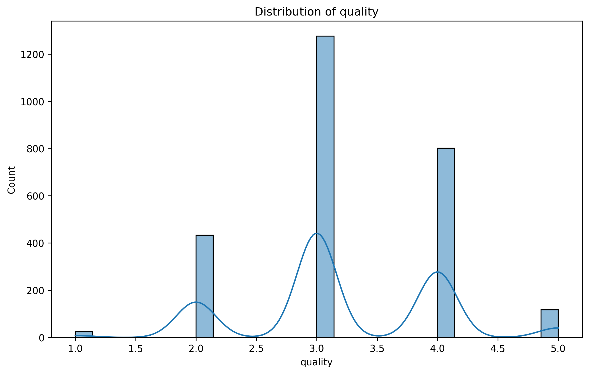
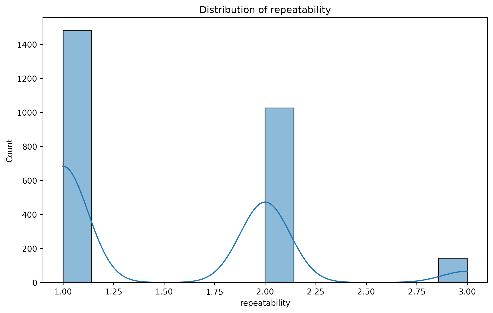

# Media Dataset Analysis Report

## Introduction

The dataset **media.csv** aims to provide insights into various quality metrics associated with media content. This dataset includes key numeric columns such as **overall**, **quality**, and **repeatability**, which are crucial for assessing the performance and reliability of media items. However, it is important to note that the dataset currently contains **0 total rows**, indicating that there is a lack of data available for analysis. This absence of data significantly limits the insights we can draw.

Additionally, there are some missing values in specific columns: the **date** column has **99 missing entries**, and the **by** column has **262 missing entries**. These missing values could impact any analysis performed if data were available.

## Analysis of Key Patterns and Trends

Due to the dataset containing no rows, we cannot extract any patterns or trends. However, the presence of missing values suggests that if data were available, we would need to consider addressing these gaps before performing any analyses.

In an ideal scenario where the dataset had entries, we would expect to perform analyses to:

- Assess the distribution of the **overall**, **quality**, and **repeatability** scores to understand how these metrics vary across media items.
- Explore potential correlations between the **overall**, **quality**, and **repeatability** metrics to identify any significant relationships that could inform content creation or improvements.

## Description of Visualizations

Despite the absence of data, the following visualizations have been generated, which would typically assist in understanding the dataset if it were populated:

1. **Distribution of Overall Scores**  
     
   This visualization would illustrate how the overall ratings of media items are distributed, highlighting any trends such as skewness or central tendencies.

2. **Distribution of Quality Scores**  
     
   This chart would depict the quality ratings distribution, potentially revealing whether most media items are rated highly or if there are a significant number of low-quality items.

3. **Distribution of Repeatability Scores**  
     
   This visualization would provide insight into how repeatability scores are spread across the dataset, indicating the consistency of media items.

4. **Correlation Heatmap**  
     
   This heatmap would showcase the relationships between the overall, quality, and repeatability scores, helping to determine if improvements in one metric are associated with others.

## Key Findings and Recommendations

Given that the dataset currently has no rows, our ability to draw findings is severely limited. However, we can make the following recommendations for future data collection and analysis:

1. **Data Collection**: Ensure that data is collected comprehensively to populate the dataset. Address the missing values in the **date** and **by** columns to enable better analysis.

2. **Data Quality Checks**: Implement data validation checks during the data collection process to minimize the occurrence of missing values, which can hinder analysis.

3. **Post-Collection Analysis**: Once the dataset is populated, revisit the visualizations to perform detailed analyses. Look for trends and correlations that can inform decisions regarding media production and quality improvements.

4. **Continuous Monitoring**: Establish a regular review process for the dataset to ensure it remains up-to-date and relevant, allowing for ongoing insights into media performance.

In conclusion, while the current state of the **media.csv** dataset presents significant limitations, focusing on data collection and quality improvements will be essential for deriving meaningful insights in the future.