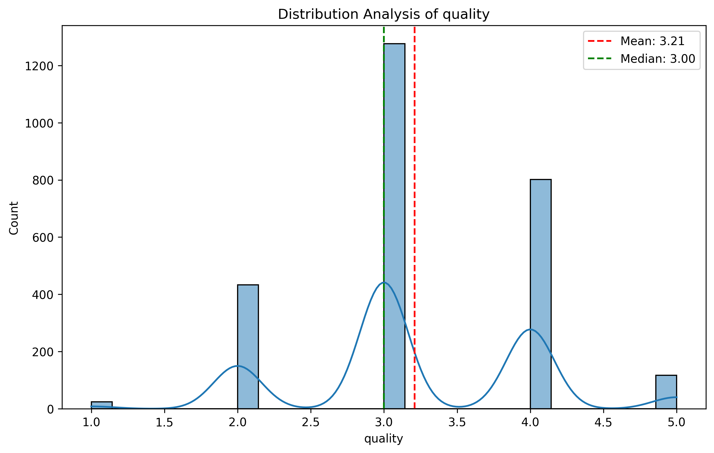

# Media Dataset Analysis Report

## Executive Summary

This report presents an in-depth analysis of the `media.csv` dataset, which comprises 2,553 records with various numeric and categorical features. The focus of the analysis includes the distribution of key metrics—overall ratings, quality, and repeatability—alongside their interrelationships. Notably, a strong correlation exists between overall ratings and quality, with insights on trends and outliers observed within the dataset. The findings aim to inform strategic decisions for media production and content curation.

---

## Detailed Analysis of Distributions and Correlations

### 1. Distribution Analysis

#### Overall Ratings
The distribution of the **overall** ratings is characterized by:
- **Mean**: 3.05
- **Median**: 3.0
- **Standard Deviation**: 0.76
- **Skewness**: 0.16 (indicating a slight right skew)

The slightly positive skew suggests that while most ratings cluster around the median, there are a few higher ratings that could influence the mean, indicating potential outliers.

#### Quality Ratings
The **quality** ratings' distribution is as follows:
- **Mean**: 3.21
- **Median**: 3.0
- **Standard Deviation**: 0.80
- **Skewness**: 0.02 (indicating nearly symmetrical distribution)

This near-symmetrical distribution signifies that quality ratings are more evenly spread, with half the ratings below 3.0 and half above.

### 2. Correlation Analysis

The correlation between key metrics reveals significant relationships:
- **Overall vs. Quality**: 0.83 (strong positive correlation)
- **Overall vs. Repeatability**: 0.51 (moderate positive correlation)

These correlations suggest that as the quality rating increases, so does the overall rating, highlighting the importance of quality in determining overall perception.

---

## Key Findings and Patterns

### Outliers
The dataset identifies notable outliers:
- **Overall Ratings**: 1216 outliers
- **Quality Ratings**: 24 outliers
- **Repeatability**: 0 outliers

### Trends Over Time
Analysis of trends shows:
- **Overall**: Trend slope = 0.00021, p-value < 0.001 (significant positive trend)
- **Quality**: Trend slope = 0.00010, p-value < 0.001 (significant positive trend)
- **Repeatability**: Trend slope = 0.00030, p-value < 0.001 (significant positive trend)

These trends indicate a gradual increase in ratings across all metrics, suggesting improvements in media quality and viewer satisfaction over time.

---

## Strategic Recommendations

1. **Focus on Quality Improvement**: Given the strong correlation between overall ratings and quality, prioritizing quality enhancement strategies could lead to better overall reception of media content.

2. **Monitor and Address Outliers**: The high number of outliers in overall ratings should prompt a review of the content associated with these ratings to understand the factors contributing to extreme perceptions. This could involve analyzing viewer feedback or adjusting marketing strategies.

3. **Leverage Positive Trends**: The upward trends in all metrics indicate a favorable trajectory in viewer satisfaction. Utilize this data to bolster marketing efforts, highlighting improved quality and overall ratings in promotional materials.

4. **Regular Data Review**: Conduct periodic analyses to track these metrics over time to identify shifting patterns or emerging trends, which can inform future content planning and production strategies.

---

This report serves as a comprehensive analysis of the media dataset, illuminating key insights and recommending actionable strategies to enhance media offerings and viewer engagement.