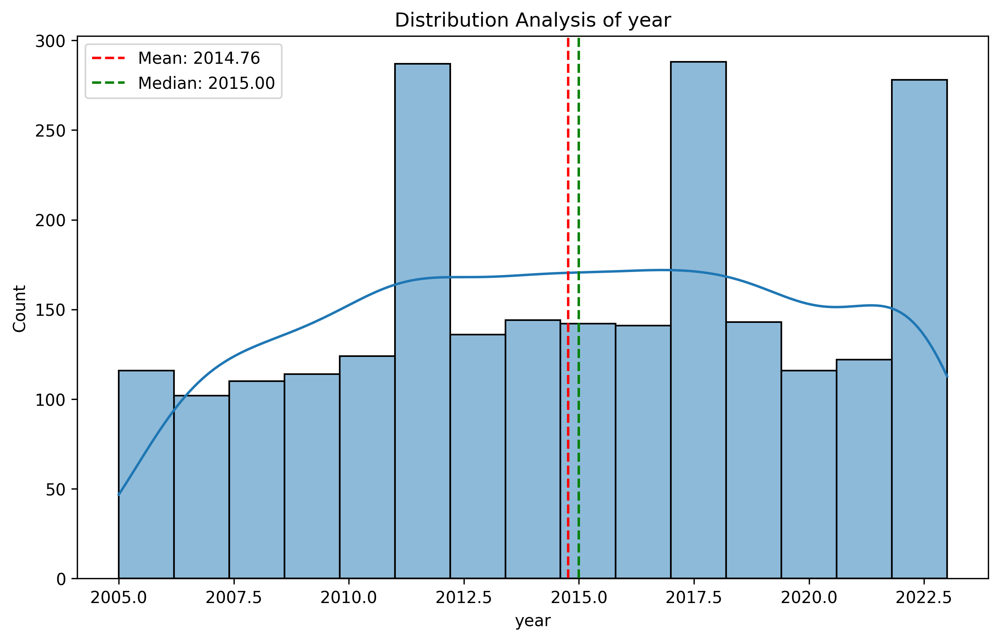
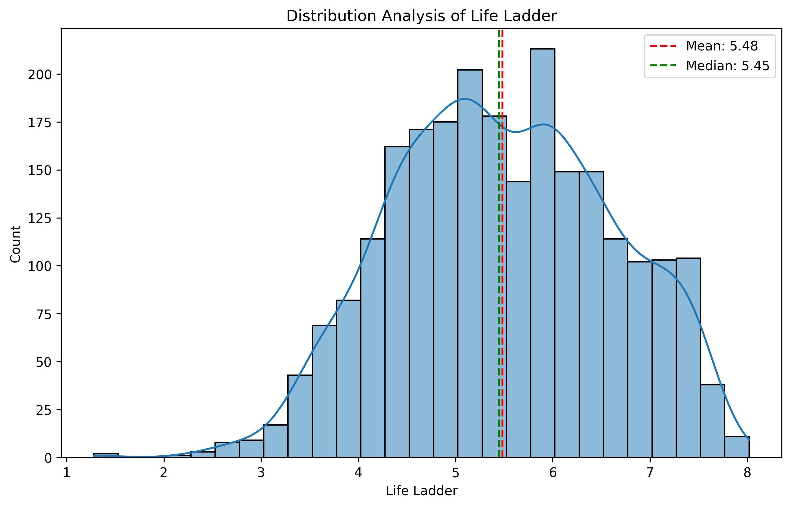
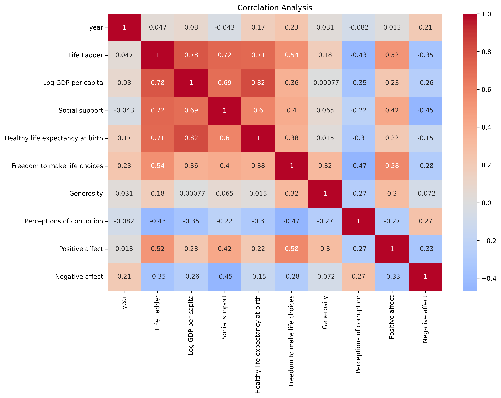

# Temp.csv Analysis Report

## Executive Summary

This report provides a comprehensive analysis of the `temp.csv` dataset, which includes 2363 records capturing various metrics related to life satisfaction and societal welfare across different countries. Key metrics such as the "Life Ladder," "Log GDP per capita," "Social support," and other social factors are examined to understand their distributions, correlations, and overall trends. Notably, the analysis identifies strong correlations between "Life Ladder" and other metrics, revealing critical insights into the factors that contribute to life satisfaction.

---

## Detailed Analysis of Distributions and Correlations

### Distribution Analysis

1. **Year Distribution**
   - 
   - **Statistics**:
     - Mean: 2014.76
     - Median: 2015
     - Standard Deviation: 5.06
     - Skewness: -0.06 (approximately symmetric distribution)

   The distribution of years indicates a balanced representation across the dataset, with a slight tendency towards the more recent years.

2. **Life Ladder Distribution**
   - 
   - **Statistics**:
     - Mean: 5.48
     - Median: 5.45
     - Standard Deviation: 1.13
     - Skewness: -0.05 (approximately symmetric distribution)

   The Life Ladder scores suggest a general tendency towards moderate life satisfaction, with most countries scoring around the mean.

### Correlation Analysis

- 

The correlation analysis reveals the following strong relationships:
- **Life Ladder and Log GDP per capita**: 0.78
- **Life Ladder and Social support**: 0.72
- **Life Ladder and Healthy life expectancy at birth**: 0.71
- **Log GDP per capita and Social support**: 0.69

These correlations highlight that higher GDP per capita and social support are closely associated with increased life satisfaction, as measured by the Life Ladder.

---

## Key Findings and Patterns

1. **Outliers**:
   - Several outliers exist in various metrics, particularly in "Perceptions of corruption" (194) and "Social support" (48). These outliers could skew the overall analysis and warrant further investigation.

2. **Trends**:
   - **Social support** shows a significant upward trend (slope: 2.41e-05, p-value: < 0.001), indicating that over time, countries are increasingly providing social support to their populations.
   - Conversely, **Negative affect** demonstrates a significant downward trend (slope: -1.78e-05, p-value: < 0.001), suggesting that people are experiencing less negative affect over time.

3. **Correlation Insights**:
   - The strongest correlation is between "Healthy life expectancy at birth" and "Log GDP per capita" (0.82), indicating that nations with higher GDP also tend to have better health outcomes.

---

## Strategic Recommendations

1. **Focus on Economic Growth**:
   - Countries aiming to improve life satisfaction should prioritize economic policies that enhance GDP per capita. This could involve investing in technology, infrastructure, and education.

2. **Enhance Social Support Systems**:
   - Given the strong correlation between social support and life satisfaction, governments should focus on developing robust social safety nets and community support programs.

3. **Health Initiatives**:
   - Addressing health disparities can lead to improved "Life Ladder" scores. Public health campaigns targeting preventive care and healthy lifestyles should be prioritized.

4. **Address Outliers**:
   - Investigate outliers in "Perceptions of corruption" and "Social support" as they may reveal critical barriers to societal well-being.

5. **Continuous Monitoring**:
   - Establish regular assessments of the metrics analyzed to track changes and adapt strategies as necessary, especially in areas showing significant trends.

---

This report encapsulates the essential findings from the `temp.csv` dataset, providing a roadmap for policymakers and stakeholders to enhance societal well-being through informed strategies.